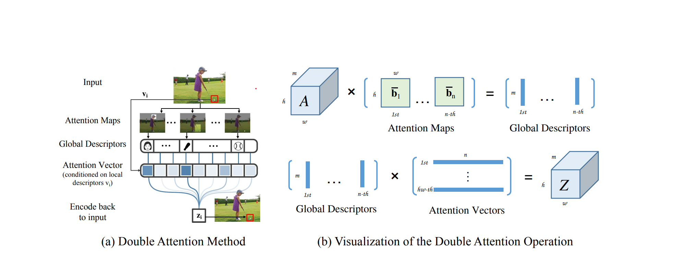
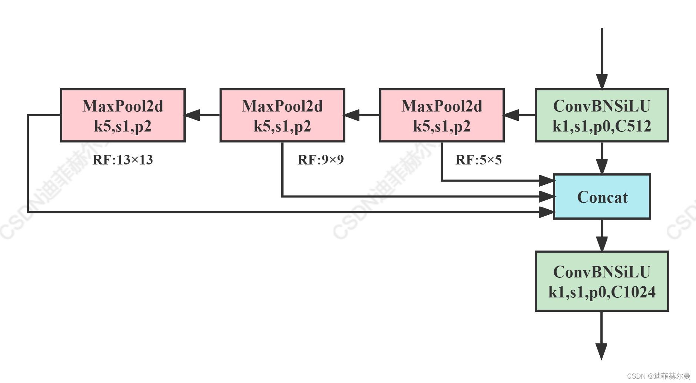
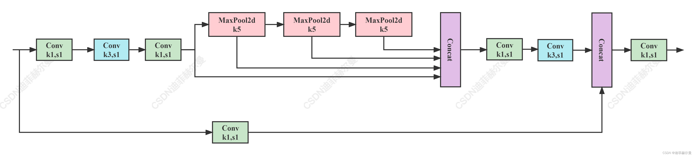
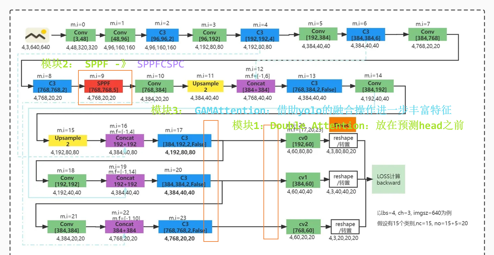

## Improvements to YOLOv5
### Module 1
Refer to [$A^2-Nets$]((https://arxiv.org/pdf/1810.11579.pdf))，which can be regarded as an evolved version of SE.
#### Double Attention Method

### Module 2
The SPPF of YOLOv5 has been improved. While maintaining the same receptive field, the speed of the model is further enhanced.

#### SPPF

#### SPPFCSPC

###Module 3
Refer to [the improvements to YOLO by others on GitHub,](https://github.com/sggq/improved-yolov5/blob/6a0e60a771907a0994af019c9283dfee2cac31d0/models/yolo.py#L42)"GAM_Attention" to the feature maps at different levels of the prediction head. This attention method can, to some extent, solve problems such as occlusion and cross - overlap'''

    class GAM_Attention(nn.Module):  
        def __init__(self, in_channels, out_channels, rate=4):  
            super(GAM_Attention, self).__init__()  

            self.channel_attention = nn.Sequential(  
                nn.Linear(in_channels, int(in_channels / rate)),  
                nn.ReLU(inplace=True),  
                nn.Linear(int(in_channels / rate), in_channels)  
            )  
          
            self.spatial_attention = nn.Sequential(  
                nn.Conv2d(in_channels, int(in_channels / rate), kernel_size=7, padding=3),  
                nn.BatchNorm2d(int(in_channels / rate)),  
                nn.ReLU(inplace=True),  
                nn.Conv2d(int(in_channels / rate), out_channels, kernel_size=7, padding=3),  
                nn.BatchNorm2d(out_channels)  
            )  
          
        def forward(self, x):  
            b, c, h, w = x.shape  
            x_permute = x.permute(0, 2, 3, 1).view(b, -1, c)  
            x_att_permute = self.channel_attention(x_permute).view(b, h, w, c)  
            x_channel_att = x_att_permute.permute(0, 3, 1, 2)  
          
            x = x * x_channel_att  
          
            x_spatial_att = self.spatial_attention(x).sigmoid()  
            out = x * x_spatial_att  
          
            return out  

'''

Brief Overview of the Above Implementation:
Channel Attention: Learn a set of weights through a Multi - Layer Perceptron (MLP) and perform a weighted calculation with the original input.
Spatial Attention: Use a Convolutional Neural Network to map the input features weighted by the channels. Map the result to the range of 0 - 1 through the sigmoid activation function, and then perform a weighted calculation with the original input, enabling the model to focus more on the regions of interest.

### Overall Improvements

Author
Shengjie LEI , Zhiyong WEI , Yulian ZHANG , Meihua FANG , Baowen WU

The Visual Computer

